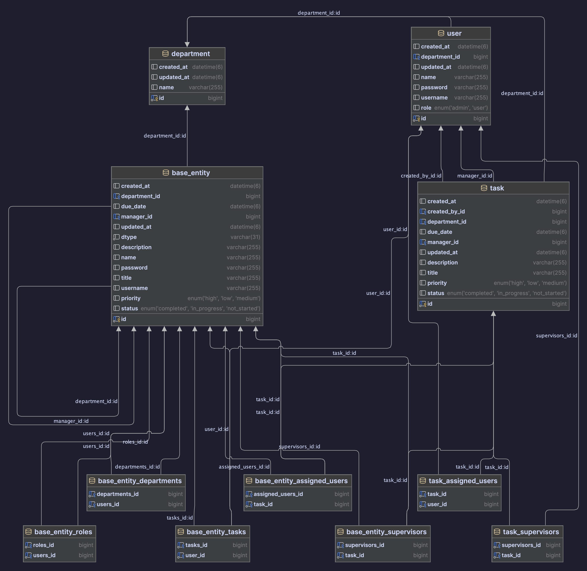
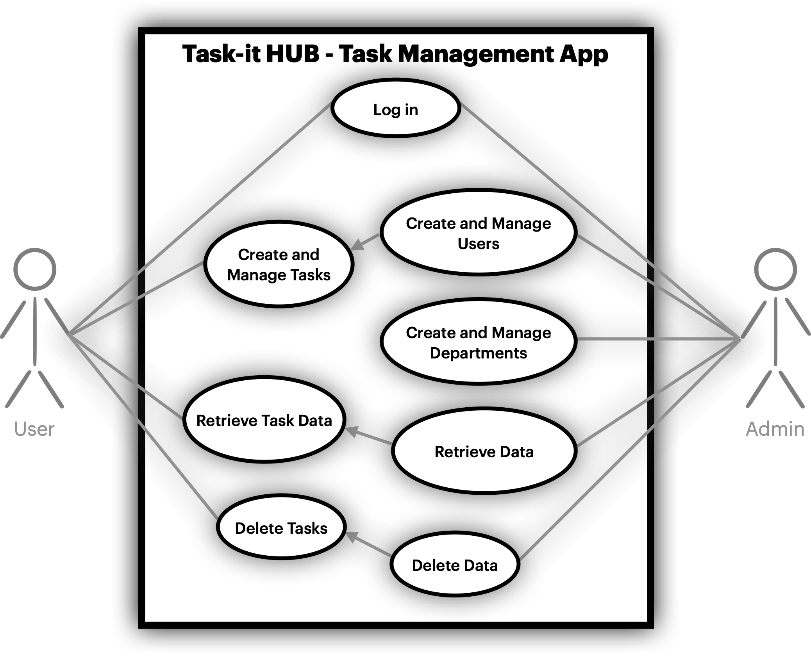

<hr style="border:5px solid grey">

<h1 align="center">Task-it HUB</h1>
<p align="center">Task manager system for the workplace</p>

<p align="center"> 
      
</p>


## Table of Contents
- [Overview](#overview) 
	- [Project Description](#project-description)
	- [Diagrams](#diagrams)
- [Tech Stack](#tech-stack)
	- [Technologies Used](#technologies-used)
	- [Controllers and Endpoint Structure](#controllers-and-endpoints-structure)
- [Future Enhancements](#future-enhancements)
- [Resources](#resources)
	- [External Links](#external-links)
	- [Contact](#contact)
	- [Acknowledgements](#acknowledgements)

## Overview
### Project Description
**Task-it HUB** is a powerful and user-friendly task management system built with Spring Boot, designed to streamline project collaboration and task tracking. This application allows its users to **create**, **assign**, and **manage** tasks within the organization's structure, ensuring that teams can work together efficiently and effectively.

**Key Features:**
- **User Management:** The system allows for the creation of users with different roles (e.g., Admin, User). Each user has a unique profile with specific permissions and access.
- **Task Management:** Users can create tasks, assign them, and track their progress. Tasks can be updated with statuses, priorities, and deadlines to ensure timely completion.
- **Department Management:** The application supports an organizational structure with departments. Tasks can be assigned to departments, and users can be organized into these departments for better collaboration.
- **Authentication and Authorization:** Utilizing Spring Security, the application ensures that only authorized users can access certain functionalities. This includes role-based access control to protect sensitive operations and data as well as preventing data loss by incorrect manipulation.
- **Data Persistence:** The application uses Hibernate as an ORM framework to manage database interactions, ensuring that all data is stored reliably and can be retrieved efficiently.
- **RESTful APIs:** Task-it HUB provides a set of RESTful APIs that allow for easy integration with other systems and enable front-end applications to interact seamlessly with the back-end services.
- **Automated Testing:** The application includes extensive testing using JUnit and Mockito to ensure code reliability and maintainability. This ensures that new features can be added without compromising existing functionality.

**How It Works:**

1. **User Registration and Authentication:** Users can register and log in to the system. Each user is assigned a role that determines their permissions within the application.
2. **Task Creation and Assignment:** Authenticated users can create tasks and assign them to themselves or other users. They can also specify task details such as descriptions, due dates, and priorities.
3. **Task Tracking and Management:** Users can update the status of tasks, add comments, and reassign tasks as needed. The system provides a clear overview of all tasks, their statuses, and who is responsible for them.
4. **Departmental Organization:** Tasks and users can be organized into departments, allowing for better management of larger teams and projects. Department heads can oversee the tasks assigned to their departments' members and ensure that everything is progressing smoothly.

### Diagrams
<p align="center">Class Diagram</p>




<p align="center">Use Case Diagram</p>
 
 


## Tech Stack
### Technologies Used
- **Java**: Programming language
- **Spring Boot**: Application framework
- **Spring Security**: Security framework
- **JUnit**: Testing framework
- **Mockito**: Mocking framework
- **Hibernate**: ORM framework
- **MySQL**: Database
- **Maven**: Build automation tool

### Controllers and Endpoints Structure
_NOTE_: The HTTP Requests use `http://localhost:8080` by default 

#### **Authentication Endpoints**

| HTTP Method | Endpoint   | Description         |
| ----------- | ---------- | ------------------- |
| POST        | /api/login | Login an admin user |
| POST        | /api/login | Login a user        |

Example:
```http
### Login ADMIN user
POST http://localhost:8080/api/login
Accept: application/json

{
   "username": "admin",
    "password": "admin"
}
```


#### **User Controller**

| HTTP Method | Endpoint          | Description                  |
| ----------- | ----------------- | ---------------------------- |
| POST        | /users            | Create a new user            |
| GET         | /users/{username} | Get user details by username |
| PUT         | /users/{id}       | Update user details          |
| DELETE      | /users/{id}       | Delete a user                |

Example:
```http
### Get all users
GET http://localhost:8080/users
Content-type: application/json
Authorization: {{token}}
```


#### **Task Controller**

| HTTP Method | Endpoint    | Description            |
| ----------- | ----------- | ---------------------- |
| POST        | /tasks      | Create a new task      |
| GET         | /tasks      | Get all tasks          |
| GET         | /tasks/{id} | Get task details by ID |
| PUT         | /tasks/{id} | Update task details    |
| DELETE      | /tasks/{id} | Delete a task          |

Example:
```http
### Updates task with task ID 5
PUT http://localhost:8080/tasks/5
Content-Type: application/json
Authorization: {{token}}

{
    "title": "Submitting project",
    "description": "Pushing repo to Github",
    "status": "COMPLETED"
}

```

#### **Department Controller** 

| HTTP Method | Endpoint          | Description                  |
| ----------- | ----------------- | ---------------------------- |
| POST        | /departments      | Create a new department      |
| GET         | /departments      | Get all departments          |
| GET         | /departments/{id} | Get department details by ID |
| PUT         | /departments/{id} | Update department details    |
| DELETE      | /departments/{id} | Delete a department          |

Example:
```http
### Delete department with ID 5
DELETE http://localhost:8080/departments/5
Authorization: {{token}}
```


## Future Enhancements
### Planned Features

- **GUI and Frontend Development:** Implement a graphical user interface and frontend for the application using modern frontend frameworks like React or Angular.
- **Enhanced Task Management:** Add more features for task dependencies, notifications, and reporting.
- **Role-Based Access Control:** Implement more granular permissions and roles to improve security and user management.
- **Integration with Third-Party Tools:** Integrate with tools like Slack, Jira, and other productivity tools for seamless workflow management.

---

## Resources
### External Links
- [Spring Boot Documentation](https://spring.io/projects/spring-boot)
- [Spring Security Documentation](https://spring.io/projects/spring-security)
- [JUnit Documentation](https://junit.org/junit5/docs/current/user-guide/)
- [Mockito Documentation](https://site.mockito.org/)
### Contact
For any inquiries, please reach out to:
- **Project Lead:** Marco Villasmil
- **GitHub Issues:** [Task-it HUB Issues](https://github.com/marcoandresv/TaskItHub/issues)
### Acknowledgements
- Thanks to all the course teammates and users for their support and feedback.
- Special thanks to  [Ironhack](https://www.ironhack.com/) for their guidance, support and resources.
